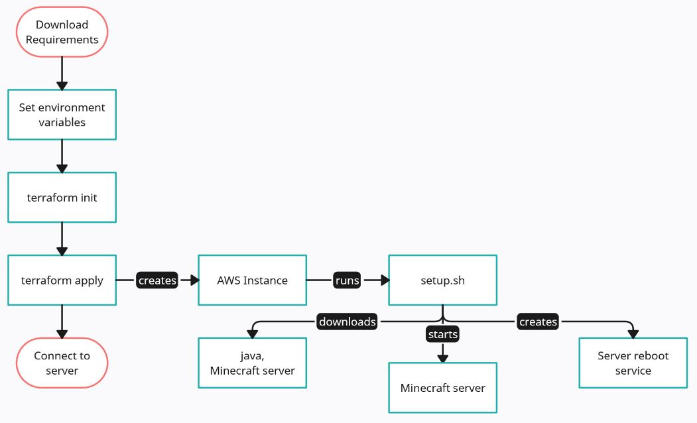

# AWS Minecraft Java Server Setup Using Terraform

## Background

This tutorial aims to automatically set up a Minecraft Java server on an AWS server instance. To accomplish this, we'll be using a Terraform script that interacts with the AWS Management Console programmatically. The Terraform script will create the instance, then run the setup script that downloads the requirements and starts the server.

## Requirements

git: [Download](https://www.git-scm.com/downloads)

Terraform: [Download](https://developer.hashicorp.com/terraform/tutorials/aws-get-started/install-cli)

AWS CLI: [Download](https://docs.aws.amazon.com/cli/latest/userguide/getting-started-install.html)

AWS Academy Learner Lab

### Requirements Steps

 1. Download the required tools from the links above, following the instructions on each page.
 2. Navigate to the folder where you will store the setup scripts.
 3. Right click in the file explorer and click "Git Bash Here" to open the git terminal. Alternatively, open the terminal elsewhere, then navigate to the desired directory using `cd {directory-path}`.
 4. Enter `git clone https://github.com/IanVanEmmerik/cs-312-project-part-2.git` to download the repo contents, then navigate to the new folder in the terminal.
 5. Launch your AWS lab.
 6. On the same page, click "AWS Details", then click "show" to display the AWS CLI. These are the credentials that Terraform will use to interact with your AWS account.
 7. Enter the following commands in the terminal, replacing each of the values with your corresponding codes. This sets the environmental variables on your local machine, allowing Terraform to read them.

    `aws configure set aws_access_key_id "<value>"`
    
    `aws configure set aws_secret_access_key "<value>"`
    
    `aws configure set aws_session_token "<value>"`

 9. You should now be ready to begin the setup process.

## Diagram

## Setup

 1. After following the Requirements Steps, enter the following command in the terminal. This will initialize the directory, downloading the necessary files for the Terraform script to run.

    `terraform init`

 2. If the command was successful, next run this command to start the terraform script. Then enter "yes" to continue.

    `terraform apply`

 3. Terraform should have created the instance, then run the setup.sh on it. The setup script has three stages. In the first stage, it downloads the necessary files (java and the Minecraft server). In the second stage, it accepts the Minecraft server EULA and starts the server. In the third stage, it creates a service that will automatically close and relaunch the server whenever the instance is rebooted.

 4. Terraform should have output the IP address of the server. If you see it, you are now ready to connect.

 5. If something goes wrong and you need to start over, you can automatically delete the instance and its requirements in your AWS Management Console by running the following command.

    `terraform destroy`

## Connecting

 1. Once you have the IP address, you can launch the game and enter it to connect to the server.
 2. Alternatively, you can verify that the server is running using the following command.

    `nmap -sV -Pn -p T:25565 <ip_address>`

 3. If the nmap command doesn't work, you may need to [download](https://nmap.org/download) it.

## Source

The Terraform and setup scripts were written with assistance from the LLM [claude.ai](https://www.claude.ai).
